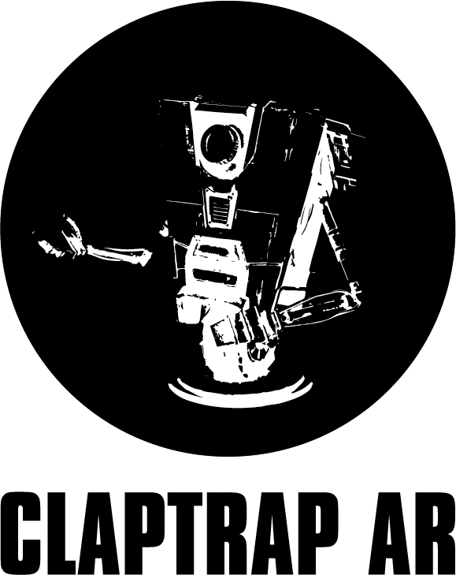
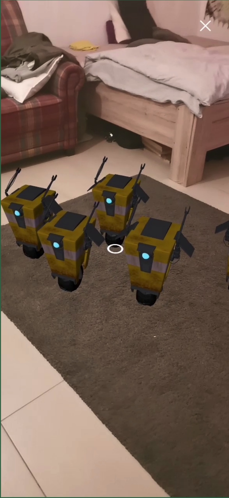

# Echtzeit-Computergrafik | Realtime-Computergraphics

<div id="top"></div>

<!-- PROJECT LOGO -->
<br />
<div align="center">
    
    <p>Wahlpflichtveranstaltung Echtzeit Computergrafik im Wintersemester 2021/22 der Fakultät Digitale Medien, Hochschule Furtwangen University</p>
    <p>Course Real-Time Computer Graphics in the winter term 2021/22 at the Faculty of Digital Media at Furtwangen University</p>
</div>

<!-- TABLE OF CONTENTS -->
<details>
  <summary>Table of Contents</summary>
  <ol>
    <li>
      <a href="#about-the-project">About The Project</a>
      <ul>
        <li><a href="#built-with">Built With</a></li>
      </ul>
    </li>
    <li>
      <a href="#getting-started">Getting Started</a>
      <ul>
        <li><a href="#installation">Installation</a></li>
      </ul>
    </li>
    <li><a href="#usage">Usage</a></li>
    <li><a href="#acknowledgments">Acknowledgments</a></li>
  </ol>
</details>

<!-- ABOUT THE PROJECT -->

## About The Project

<div align="center">
    
</div>

<p align="left">This project is part of the course Real-Time Computer Graphics in the winter term 2021/22 at the Faculty of Digital Media at Furtwangen University. It is an AR application that runs in the browser via Web XR and is implemented using three.js. The goal is to spawn a 3D model from Blender via the GLTF loader of three.js into your local area and then animate it. The 3D Model is an Claptrap known from the game Borderlands, which was made in Blender.</p>

<p align="right">(<a href="#top">back to top</a>)</p>

### Built With

- [Web XR Device API](https://www.w3.org/TR/webxr/)
- [three.js](https://threejs.org/)

<p align="right">(<a href="#top">back to top</a>)</p>

<!-- GETTING STARTED -->

## Getting Started

To start the project locally there is no further software installation required. Just clone the repository and open the index.html in an WebXR compatible Browser (a lot of Browsers are not compatible).

You can find a list of compatible Browsers here:
https://caniuse.com/webxr

You will also need to start the application on an HTTPS Server. You can also set up HTTPS on your localhost.

You can find Instructions of how to set up HTTPS on localhost for MacOS here:
https://medium.com/@jonsamp/how-to-set-up-https-on-localhost-for-macos-b597bcf935ee

You can also load this Repository into your Github-Pages and start it there. Y
ou can find Instructions of how to set up Github-Pages here:
https://pages.github.com/

Try out the application now on our Github Pages:
https://koliyoshii.github.io/

### Installation

1. Clone the repo
   ```sh
   git clone https://github.com/Koliyoshii/ECPShiftingShaders
   ```
2. Open the index.html in a compatible Browser with https

<p align="right">(<a href="#top">back to top</a>)</p>

<!-- USAGE EXAMPLES -->

## Usage

When the index.html is open you will see a Button "Start AR". If the button says "WebXR is not available" your Browser is propably not supported. Tap on the button to start the application. You can see now the image of the camera. The application will then do a Hit-test and search for surfaces like your ground or a table. When there is a surface a circle will appear. Then tap on your screen to spawn a claptrap.

<p align="right">(<a href="#top">back to top</a>)</p>

<!-- ACKNOWLEDGMENTS -->

## Acknowledgments

- [Code for Hit-test in WebXR](http://threejs.ir/examples/webxr_ar_hittest.html)
- [three.js Documentation](https://threejs.org/docs/)
- [Informations about the GLTF Loader](https://threejs.org/docs/#examples/en/loaders/GLTFLoader)

<p align="right">(<a href="#top">back to top</a>)</p>

<!-- MARKDOWN LINKS & IMAGES -->

[product-screenshot]: images/screenshot.jpg
